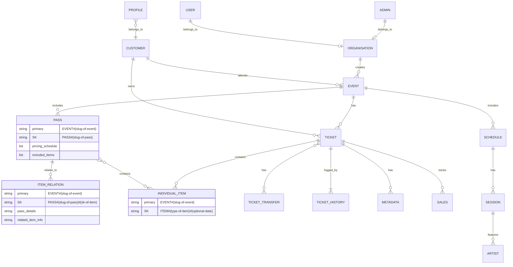
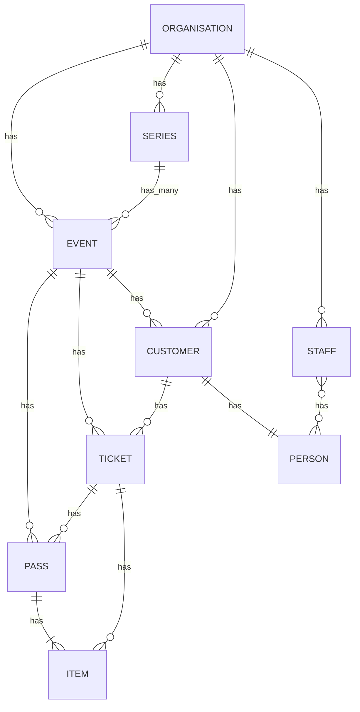

# Data Structure

# ERD



# Fields

- **Event**
    
    **PK :** `EVENT#{slug-of-event}`
    
    **SK :** `EVENT#{slug-of-event}`
    
    **Name** : `Title`
    
    **Slug :**  `use-for-ref`
    
    **Start**: `Date` 
    
    **End**: `Date`
    
- **Items**
    
    **PK :** `EVENT#{slug-of-event}`
    
    <!-- **SK:**  PASS#Individual#ITEM#{TYPE}#{?Day} -->
    
    **Name:** `Name of thing`
    
    **Day?** : `YYYMMDD | ALL | missing`
    
    **Type of thing** : `Classes, Party, Physical Item, Digital Item, Access for whole event, Pass`
    
- **Pass (multiple rows)**
    
    **PK :** `EVENT#{slug-of-event}`
    
    **SK :** `PASS#{name-of-pass}#ITEM_SK`
    
    **Name** : `Name of pass`
    
    **Description:** `How is shown`
    
    **Saving:**  `Auto Calculated when items change`
    
    **~~Includes:**  `[Item#SK,Item#SK]`~~
    
    **Live:** `Boolean | Date?`
    
- **Ticket**
    
    **PK :** `EVENT#{slug-of-event}`
    
    **SK :** `TICKET#{ticket_number}`
    
    **Number**: `Not a number`
    
    **Includes:** `[Item#SK,Item#SK]`
    

### Database


# Views

## DE Dashboard

## Client Dashboard

- Event Management
    - Create an event
    - Overview of all events - including quick metrics
    - Detailed event view
        - Event analytics
        - General settings
        - Ticket management - create/manage ticket types
        - Allowable upgrades
    - Ticket scanner settings - choose wristband/items colours/names
- Attendees management
    - Summary of tickets across all events, viewable by event, filterable by ticket type, status, payment method,
    - Detailed ticket view - view all details of a ticket and perform admin actions
    - Ticket transfer - transfer between owners and events (modal)
    - Ticket upgrades - manual ticket upgrades/downgrades (modal)
    - Ticket refunds - Process and track refund, allow to decide on amount refunded (modal)
    - Ticket resend - resend ticket qr code (modal)
    - Ticket check-in - check in a attendee and view wristbands (modal)
    - Import tickets from file
- Ticket Scanner
- Feedback
- Scheduler
- Account and settings

## Customer View

- Overview of all tickets/events
- Detailed new of a ticket
- Ticket upgrade - options and costs
- Transfer ticket
- Personal schedule view - based on ticket type (opportunity for upsell if they don’t have access to something)
    - Create a list of sessions to attend
    - sign up for limited sessions
- Ticket download
- Ticket support form

# Access Patterns


# Entity & Key

### Base table

| Entity | PK | SK | Notes |
| --- | --- | --- | --- |
| TICKET | EVENT#org-slug#event-slug#TICKET#ksuid | CUSTOMER#ksuid |  |
| EVENT | EVENT#org-slug#event-slug | EVENT#org-slug#event-slug |  |
| PASS(TYPE) | PASS#ksuid | EVENT#org-slug#event-slug | Bundle? |
| PASS(PURCHASE) | PASS#ksuid | EVENT#org-slug#event-slug#TICKET#ksuid |  |
| ITEM(TYPE) | ITEM#ksuid | EVENT#org-slug#event-slug |  |
| ITEM(PURCHASE) | ITEM#ksuid | EVENT#org-slug#event-slug#TICKET#ksuid |  |
| PERSON | PERSON#identifier | PROFILE#identifier |  |
| CUSTOMER | PERSON#identifier | CUSTOMER#ksuid |  |
| STAFF | PERSON#identifier | STAFF#org-slug#ksuid |  |
| ORGANISATION | ORGANISATION#org-slug | ORGANISATION#org-slug |  |
| SERIES | SERIES#series-slug | SERIES#series-slug |  |

### **Show an event and purchase options**

Might be same index as showing tickets, depends on projected elements

| Entity | PK(SK) | SK(PK) | Notes |
| --- | --- | --- | --- |
| EVENT | EVENT#org-slug#event-slug | EVENT#org-slug#event-slug |  |
| PASS(TYPE) | EVENT#org-slug#event-slug | PASS#ksuid |  |
| ITEM(TYPE) | EVENT#org-slug#event-slug | ITEM#ksuid |  |

### **Purchase a ticket**

BatchWrite

Creates a customer if needed (check exists PERSON#identifier)

Creates ticket(s) EVENT#org-slug#event-slug#TICKET#ksuid, CUSTOMER#ksuid

### **Show a customer their tickets**

| Entity | PK(SK) | SK(PK) | Notes |
| --- | --- | --- | --- |
| TICKET | CUSTOMER#ksuid | EVENT#org-slug#event-slug#TICKET#ksuid |  |
| CUSTOMER | CUSTOMER#ksuid | PERSON#identifier |  |

### **Show organisations Events**

| Entity | GSI1PK | GSI1SK(PK) | Notes |
| --- | --- | --- | --- |
| ORGANISATION | EVENTLIST#org-slug | ORGANISATION#org-slug |  |
| EVENT | EVENTLIST#org-slug | EVENT#org-slug#event-slug |  |

### **Show Series of Events**

| Entity | GSI2PK | GSI2SK(PK) | Notes |
| --- | --- | --- | --- |
| SERIES | SERIESEVENTLIST#series-slug | ORGANISATION#org-slug |  |
| EVENT | SERIESEVENTLIST#org-slug | EVENT#org-slug#event-slug | Do we need a KSUID for events to enable ordering or just a YYYYDDMM-at start of slug?  
What do we do about events that change date? 
Should we singleton it? |

### Show an events tickets

### Show an events customers

### Get a ticket and it’s items and passes

| Entity | GSI3PK | GSI3SK(PK) | Notes |
| --- | --- | --- | --- |
| TICKET | EVENT#org-slug#event-slug#TICKET#ksuid | TICKET#ksuid |  |
| PASS(PURCHASE) | EVENT#org-slug#event-slug#TICKET#ksuid | PASS#ksuid |  |
| ITEM(PURCHASE) | EVENT#org-slug#event-slug#TICKET#ksuid | ITEM#ksuid |  |

### Show all purchases of a type of thing

| Entity | GSI3PK | GSI3SK(PK) | Notes |
| --- | --- | --- | --- |
| PASS(TYPE) | PASS#ksuid |  |  |
| PASS(PURCHASE) | PASS#ksuid |  |  |



# Entity & Key v2

| **Entity** | **PK** | **SK** | **GSI1PK** | **GSI1SK** | **GSI2PK** | **GSI2SK** | Notes |
| --- | --- | --- | --- | --- | --- | --- | --- |
| Organisation | `ORGANISATION#{org-slug}` | `ORGANISATION#{org-slug}` |  |  |  |  |  |
| Series | `SERIES#{org-slug}#{event-slug}` | `SERIES#{org-slug}#{event-slug}` | `EVENTLIST#{org-slug}` | `SERIES#{org-slug}#{event-slug}` |  |  |  |
| Event (series instance) | `EVENT#{org-slug}#{event-slug}#{YYYY-MM-DD}` | `SERIES#{org-slug}#{event-slug}` | `EVENTLIST#{org-slug}` | `EVENT#{org-slug}#{event-slug}#{YYYY-MM-DD}` |  |  | +1 |
| Event | `EVENT#{org-slug}#{event-slug}` | `EVENT#{org-slug}#{event-slug}` | `EVENTLIST#{org-slug}` | `EVENT#{org-slug}#{event-slug}` |  |  | What do we use this for? Is it like setup and then repeat? I figured we’d use last one (rather than Outlook style repeat every) |
| Pass | `PASS#{ksuid}` | `EVENT#{org-slug}#{event-slug}` |  |  |  |  |  |
| Item | `ITEM#{ksuid}` | `EVENT#{org-slug}#{event-slug}` |  |  |  |  |  |
| Person   | `PERSON#{identifier}` | `PERSON#{identifier}` |  |  |  |  |  |
| Customer | `PERSON#{identifier}` | `CUSTOMER#{ksuid}` |  |  |  |  |  |
|  |  |  |  |  |  |  |  |

# Architecture


```
// Diagram elements

Dance Engine Admin Repo [icon: github] {
  DE Dashboard [icon: settings]
  Client Dashboard [icon: settings]
  Admin API [icon: server] {
    DE Top-Level [icon: cloud]
    DE Client-Level [icon: cloud]
  }
}

Dance Engine Core Repo [icon: github] {
  API [icon: server] {
    DE Core [icon: cloud]
    DE Customer [icon: cloud]
  }
  Shared Prismic Slices [icon: layers]
  Template website [icon: copy]
}

Website deployment [icon: repeat, color: blue]{
  Prismic Repository [icon: layout]
  Tenant_Vercel [icon: vercel, label: "Vercel Deployment"]
}

DE_Vercel [icon: vercel, label: "Vercel Deployment"]
DynamoDB [icon: aws-dynamodb]

// Connections
Dance Engine Admin Repo - DE_Vercel
Website deployment <> DynamoDB
Dance Engine Admin Repo > DynamoDB: Manage Data
Template website > Prismic Repository: Duplicates to
Shared Prismic Slices < Prismic Repository
Prismic Repository - Tenant_Vercel
Dance Engine Admin Repo > Website deployment: Deploys
```

# Principles

- Dates in Human Readable Form
Either data only 2025-09-01 or IS0-8601 2020-03-06T15:14:15
- _at and _on
A Date thing happens exactly _at or if it’s a day __on e.g updated_at or teaching_day_on. generally we preferer _at and a specific time unless it should never be used as a time
- ID and Numbers use KSUIDs
This include ticket numbers (stop the phone number scan issue)
- Barcodes include URL of where to scan them